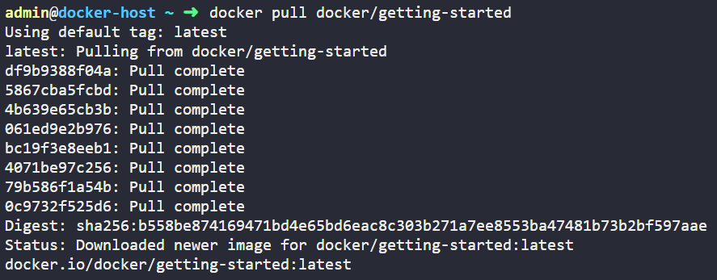

# Assignment2-Docker

## Task1

Demonstrate a minimum of 15 basic docker commands with an explanation and screenshots.

**Solution:**

1. **docker pull** **<<image_name>>** —> Pulls the image from the repository

 

1. **docker —version** —> Displays the version of the docker

1. **docker run** —> Runs the image as a container

Example: 

docker run -d -p 80:80 docker/getting-started

-d —> detach mode 

-p 80:80 —> maps the host port 80 to container port 80

1. **docker images** —> Displays the current pulled images

1. **docker ps** —> To list all the running containers.

1. **docker stop <<container_id>>** —> Stops the running container

1. **docker start <<container_id>>** —> Starts the container

1. **docker logs <<container_id>>** —> Displays logs of the container
    
    
    
2. **docker kill <<container_id>>** —> Force shutdown the container
    
    
    

10. **docker rm <<container_id>>** —> Removes the container from the machine

1. **docker rmi <<image_name>>** —> Removes the image from the machine
    
    
    
2.  **docker rename <<old_name>> <<new_name>>**  —> Rename the container
    
    
    
3. **docker port <<container_id>>** —> Displays the port mapping of the container
    
    
    
4. **docker stats** —> Displays the usage statistics of docker
    
    
    
5. **docker inspect <<image_name>>** —> Get the low-level information on the image in JSON format
    
    
    
6. **docker build -t <<image_name>> .** —> To build images
    
    
    

## Task2

[Hello, World Docker Image](https://hub.docker.com/_/hello-world) Run Hello World Docker Image Locally.

**Solution:**

## Task3

Create a hello world FastAPI application. Create a Dockerfile for your FastAPI hello world application. Build Docker image using Docker file. Run the docker image build in the previous step. Push your Docker image to Docker Hub.

**Solution:**

[https://github.com/nav52/dockerAssignment](https://github.com/nav52/dockerAssignment)

## Task4

Automate the Assignment below task using GitHub action.

1. Build Docker Image
2. Push Docker Image to Docker hub.

**Solution:**

[https://github.com/nav52/dockerAssignment](https://github.com/nav52/dockerAssignment)

- Create Docker hub token and add them to GitHub repository secrets
- Create the YAML file in the .github/workflows/ to login to Docker hub, build the image on push to the main branch and push the ‘image’ to the docker hub repository.

